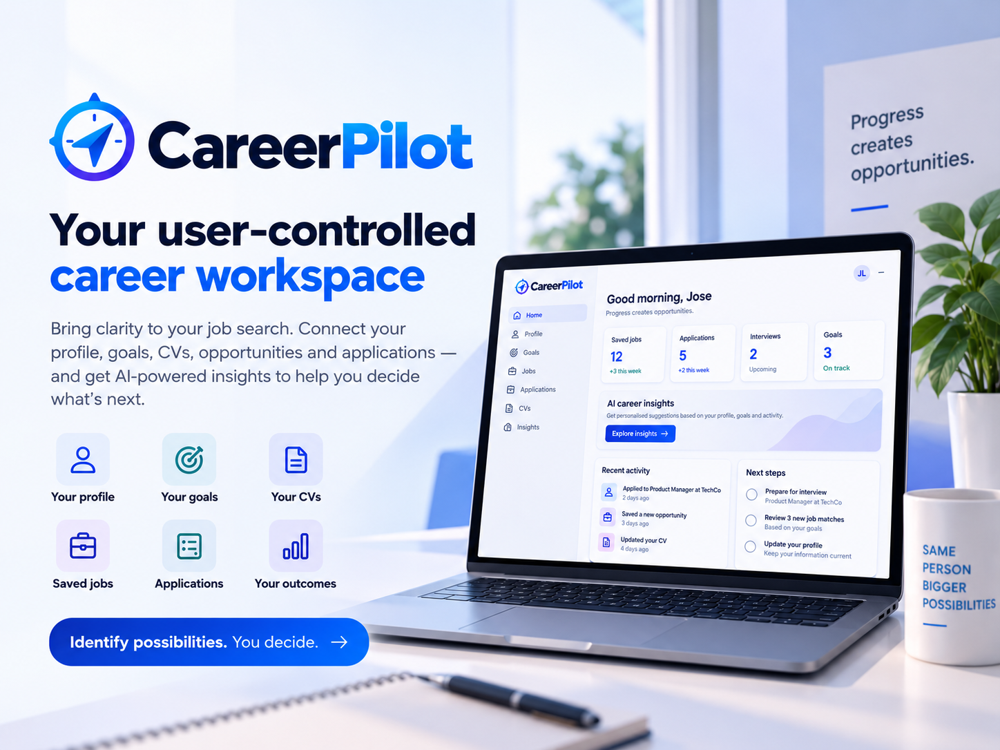

# CareerPilot — AI Product Management Case Study

An AI-assisted job-search workspace designed to help active job seekers turn opportunities, applications, and outcomes into better-informed decisions. This project was developed as part of the **Ironhack AI Product Manager Bootcamp**.

> **CareerPilot identifies possibilities; the job seeker decides.**

📄 **Quick Links:** [Product Requirements Document](docs/PRD.md) • [User Research](docs/User%20Insight%20Artifact.md) • [Slide Presentation](docs/Presentation.pdf) • [Responsible AI Statement](docs/AI%20Responsibility%20Statement.md)

## 📑 Table of Contents

- [🚀 Project Overview](#-project-overview)
- [🎯 Problem Statement](#-problem-statement)
- [💡 Proposed Solution](#-proposed-solution)
- [🔎 Research & Key Insights](#-research--key-insights)
- [👤 Target Users](#-target-users)
- [🧱 MVP Scope](#-mvp-scope)
- [📊 Success Metrics](#-success-metrics)
- [🎨 Product Experience](#-product-experience)
- [🤖 Responsible AI](#-responsible-ai)
- [📈 Monitoring & Event Tracking](#-monitoring--event-tracking)
- [🎨 Slide Presentation](#-slide-presentation)
- [📄 Project Deliverables](#-project-deliverables)
- [🛠 Product Management Skills Demonstrated](#-product-management-skills-demonstrated)
- [🧰 Tools Used](#-tools-used)
- [📸 Project Preview](#-project-preview)
- [📚 About this Project](#-about-this-project)
- [💭 Reflection](#-reflection)
- [👥 Team](#-team)

## 🚀 Project Overview

CareerPilot is an AI-assisted career-management workspace for active job seekers managing several opportunities at once. It connects professional context, career goals, multiple CVs, saved jobs, applications, outcomes, factual metrics, and cautious AI guidance in one experience.

The core workflow is:

> **Profile & Goals → Opportunities → Application Decisions → Progress & Outcomes → Insights → Next Actions**

CareerPilot is deliberately not a job board, recruiter platform, or autonomous application agent. It focuses on a more specific product question:

> **How might we help active job seekers turn the information generated during their search into confident decisions about where to invest effort and what to do next?**

The product is designed around a clear principle:

> **CareerPilot identifies possibilities; the job seeker decides.**

## 🎯 Problem Statement

Active job seekers make repeated decisions with incomplete feedback. They may need to decide:

- Whether an imperfect-fit opportunity is worth pursuing
- How much tailoring effort an application justifies
- What recent applications and outcomes might suggest
- Which parts of their approach deserve attention
- Where to focus their effort next

CareerPilot began as a broader CV-builder and application-tracker concept. Research weakened both as primary differentiators: established products already provide substantial CV and tracking functionality, while user behaviour varies significantly.

### The opportunity

The stronger directional signal was not simply a need for more information. It was the gap between **recording job-search activity** and **interpreting it responsibly enough to support a useful next decision**.

The refined problem hypothesis is:

> Active job seekers may struggle to turn information from their job search into confident decisions about which opportunities deserve effort and what they should change based on application outcomes.

This remains an evidence-informed hypothesis to validate, not a proven market-wide problem.

## 💡 Proposed Solution

CareerPilot brings the key parts of an active job search into one connected workspace and uses AI as a cautious decision-support layer.

The product helps users:

- Create and maintain professional context and career goals
- Manage several CVs for different types of opportunities
- Save jobs and separately record real applications
- Track progress from Saved to Applied, Interview, Offer, Rejected, Withdrawn, or Closed
- Record outcomes and explicit employer feedback when it exists
- Review factual activity and outcome metrics
- Compare a selected CV with a saved opportunity
- Create a reviewable, job-specific CV copy without changing the original
- Consider contextual insights and possible next actions
- Review, dismiss, and rate recommendations

The AI does not make the final decision. It provides an evidence-grounded first perspective that the job seeker can question, correct, dismiss, or act on.

## 🔎 Research & Key Insights

Discovery combined:

- A structured user survey with **5 respondents**
- Secondary research using **6 BLS and NBER sources**
- A self-conducted think-aloud exploration of FlowCV, Huntr, and Teal
- Competitive analysis and review of manual alternatives such as spreadsheets, Notion, email, bookmarks, and memory

### Key insights

1. **Outcome visibility showed the clearest signal.** Four of five respondents did not clearly know which parts of their job search worked best; four also reported changing strategy based on results.
2. **Rejection creates an information need, not reliable causal evidence.** Four of five wanted to understand why they were rejected, but CareerPilot cannot infer an employer's true reason without explicit evidence.
3. **Job-fit decisions are trade-offs.** People may apply without meeting every requirement, so the useful question is often whether an opportunity merits the effort—not a binary qualified/unqualified verdict.
4. **Tailoring is relevant but not universal.** Reported behaviours ranged from reusing one CV to making small changes or using AI tools.
5. **Tracking is an enabler, not validated differentiation.** Respondents used memory, spreadsheets, job-board tools, or no tracker, while established competitors already offer mature tracking.

### Research limitations

The evidence is directional. The survey sample was small (n=5), convenience-based, and self-reported. No qualitative user interviews were completed. Competitor think-aloud observations were conducted by the project owner rather than independent usability participants. Secondary research provides broader context but does not prove demand for CareerPilot.

Pain severity, trust, data sufficiency, actionability, strongest user segment, willingness to pay, and behavioural impact all require further validation.

🔗 [Read the complete User Insight Artifact](docs/User%20Insight%20Artifact.md)

## 👤 Target Users

The current primary user is an **active job seeker applying to multiple positions simultaneously**.

### Working persona: Alex

Alex is a synthetic persona based on the current research evidence. The name and narrative are illustrative; the underlying behaviours and needs are research-grounded.

Alex wants to:

- Decide which opportunities are worth pursuing
- Make confident choices when experience does not perfectly match a job
- Understand what application outcomes may be indicating
- Adjust the job-search strategy based on results
- Spend time and effort where it is most likely to be useful

The research does not yet establish a final segment by career stage, industry, seniority, or employment status. Further validation is required to identify where the problem is strongest.

## 🧱 MVP Scope

The MVP was intentionally focused on testing CareerPilot's connected decision-support experience within a **10-day capstone delivery window**.

### Core decision-support capabilities

- Contextual opportunity analysis
- Transparent CV–Job Match Assessment
- AI-assisted CV tailoring that creates a separate copy
- Job-search insights based on recorded information
- Potential next-action recommendations
- Recommendation review, dismissal, and usefulness feedback
- Clear uncertainty and insufficient-information states

### Supporting product capabilities

- Account access and a private workspace
- Professional profile and career goals
- Multiple named CVs with three fixed one-column templates
- CV visibility controls, preview, and PDF export
- Manual and user-reviewed URL-assisted job capture
- Kanban application workflow
- Separate application, progression, outcome, and employer-feedback records
- Dashboard with factual metrics and cautious patterns

### Intentionally out of scope

The MVP does not attempt to provide:

- A native job marketplace or job board
- Recruiter or employer workflows
- Autonomous job applications
- Automatic career decisions
- Employer ATS access or hiring predictions
- Guaranteed interview, offer, or employment outcomes
- Advanced freeform CV design
- Dedicated native mobile or desktop products

This prioritisation follows one principle:

> **Build the minimum connected experience needed to test whether CareerPilot can provide useful decision support.**

## 📊 Success Metrics

The MVP measurement framework focuses on whether users reach, review, and find the differentiated decision-support experience useful.

### Recommendation Usefulness Rate — North Star

**Target: ≥70%**, with feedback collected on at least 50% of reviewed recommendations.

Helpful ratings ÷ all explicit Helpful + Not Helpful ratings.

### Recommendation Review Rate

**Target: ≥60%**

Unique recommendations meaningfully reviewed ÷ eligible recommendations shown.

### Recommendation Feedback Coverage

**Target: ≥50%**

Reviewed recommendations receiving feedback ÷ unique recommendations reviewed.

### Context Readiness Rate

**Target: ≥70%**

Users who complete enough relevant context for a meaningful recommendation ÷ the relevant validation cohort.

Interview Rate, Offer Rate, and Time to Job are tracked only as **downstream observational metrics**. They establish baselines; they are not outcomes CareerPilot can claim to cause or control.

Current dashboard values are **simulated demo data**, not real-user validation results.

## 🎨 Product Experience

The experience is designed around a connected, user-controlled workflow:

1. Create professional context and career goals
2. Create or choose a CV
3. Save and review an opportunity
4. Decide whether it deserves effort
5. Record an application separately from saving the job
6. Track progress and record factual outcomes
7. Review dashboard patterns and AI-supported insights
8. Examine the evidence and limitations behind a recommendation
9. Dismiss it, rate it, or choose a next action

The interface keeps four kinds of information distinct:

- User-provided facts
- Explicit employer feedback
- Factual product metrics
- AI-generated interpretation

AI CV tailoring is reversible and non-destructive: it creates a new CV copy, preserves the original, and requires human review.

## 🤖 Responsible AI

Responsible AI was treated as part of the product design rather than a final compliance step.

### Human-in-the-loop

CareerPilot does not submit applications, decide whether someone should apply, or take consequential career actions on the user's behalf.

### Evidence boundaries

User facts, explicit employer evidence, factual calculations, and AI interpretation remain distinguishable. Unknown rejection reasons stay unknown.

### Avoiding overconfidence

The CV–Job Match result is a CareerPilot document-to-job assessment—not an employer ATS score, eligibility verdict, interview probability, or hiring prediction.

### User control

Users can review recommendations, correct the underlying information, dismiss suggestions, request another analysis, and provide usefulness feedback.

### Data minimisation

Only the minimum context needed for a specific feature should be used. Credentials, secrets, hidden CV content, another user's data, and unnecessary sensitive information are excluded.

### Safe failure

If a critical guardrail cannot be met, the affected capability should be disabled from the validation build rather than knowingly exposed.

🔗 [Read the AI Responsibility Statement](docs/AI%20Responsibility%20Statement.md)

## 📈 Monitoring & Event Tracking

The measurement journey is:

> **Registered → Context Ready → Recommendation Shown → Recommendation Reviewed → Feedback Provided**

The tracking model covers account creation, context readiness, saved jobs, recorded applications, status changes, outcomes, recommendation exposure, meaningful review, feedback, and dismissal.

Successful actions are counted only after they succeed. Repeated recommendation views are de-duplicated, dismissal remains separate from a Not Helpful rating, and personal narrative or raw CV content does not belong in analytics events.

🔗 [Read the Event Tracking specification](docs/Event%20Tracking.md) • [Open the Monitoring Dashboard PDF](docs/Monitoring%20Dashboard%20.pdf)

## 🎨 Slide Presentation

The complete product story is presented through a slide deck covering:

- Executive summary and problem opportunity
- Research evidence and limitations
- User insight and product direction
- Competitive context
- Core workflow and MVP scope
- AI decision support and Responsible AI
- Success metrics and monitoring
- Product decisions, reflection, and next steps

### 🔗 Presentation

[Open the CareerPilot Slide Presentation](docs/Presentation.pdf)

## 📄 Project Deliverables

### Product Requirements Document

[View the Product Requirements Document](docs/PRD.md)

Defines the product context, problem, persona, Jobs-to-be-Done, scope, 37 user stories, prioritisation, metrics, risks, privacy, Responsible AI, go-to-market thinking, and roadmap.

### User Insight Artifact

[View the User Insight Artifact](docs/User%20Insight%20Artifact.md)

Documents the research questions, methods, evidence base, competitive analysis, triangulation, insights, decisions, and limitations.

### AI Responsibility Statement

[View the AI Responsibility Statement](docs/AI%20Responsibility%20Statement.md)

Defines data boundaries, human control, limitations, critical failure modes, escalation, and the role of AI during the project.

### AI Use Reflection

[View the AI Use Reflection](docs/AI%20Use%20Reflection.md)

Explains where AI accelerated the work, where it introduced risk, and why evidence, judgement, and accountability remained human-owned.

### Event Tracking & Monitoring

[View Event Tracking](docs/Event%20Tracking.md) • [View the Monitoring Dashboard](docs/Monitoring%20Dashboard%20.pdf)

Defines the validation funnel, activation event, product signals, metric formulas, data-quality rules, and responsible measurement boundaries.

## 🛠 Product Management Skills Demonstrated

This project demonstrates practical Product Management skills including:

- Product Vision & Strategy
- Problem Definition
- Discovery & User Research
- Secondary Research
- Competitor Analysis
- Evidence Triangulation
- User Persona Development
- Jobs-to-be-Done
- MVP Definition
- Feature Prioritisation
- Requirements Definition
- User Stories & Acceptance Criteria
- Backlog Traceability
- Product Metrics & Activation
- Event Tracking & Monitoring
- Responsible AI
- Privacy & Data Minimisation
- Product Roadmapping
- Stakeholder Presentation
- AI-assisted Prototyping

## 🧰 Tools Used

- **ChatGPT** — research support, synthesis, documentation, KPI logic, and critical review
- **Jira Product Discovery** — product ideas, prioritisation, and roadmap
- **Jira Software** — Epics, Stories, acceptance criteria, dependencies, and delivery planning
- **Confluence** — prioritisation and product documentation
- **Lovable** — AI-assisted MVP creation and iteration

AI was used throughout the project to accelerate research support, synthesis, documentation, planning, and prototyping. Every material product decision remained subject to human review.

## 📸 Project Preview

The repository contains the main artefacts produced during the capstone:

- Product Requirements Document
- User Insight Artifact
- AI Responsibility Statement
- AI Use Reflection
- Event Tracking specification
- Monitoring Dashboard
- Slide Presentation
- Working MVP repository
- CareerPilot hero and visual assets

## 📚 About this Project

CareerPilot was developed as a **solo school project during the Ironhack AI Product Manager Bootcamp**. The objective was to apply Product Management practices to a realistic AI product challenge—from problem discovery through research, product strategy, prioritisation, Responsible AI, MVP creation, and measurement design.

The project is presented as an **MVP case study**, not as a commercially launched or statistically validated product. It does not claim production-scale analytics, proven hiring impact, or guaranteed career outcomes.

## 💭 Reflection

The most important lesson was that research should be allowed to change the product. CareerPilot started with CV creation and application tracking near the centre. The evidence did not support treating either as the primary problem, so the concept shifted toward the more uncertain—but potentially more differentiated—space between job-search information and decisions.

AI was most effective as a speed and structure multiplier. It was most risky when polished output could be mistaken for evidence or settled judgement. Competitor assumptions needed correction, simulated data needed explicit labels, and limited research needed careful language.

The next step would be to validate CareerPilot with a broader and more diverse group of active job seekers, focusing on pain severity, trust, data sufficiency, recommendation usefulness, and whether the support changes real decisions.

> **Use AI to accelerate the work; keep evidence, judgement, and accountability human-owned.**

## 👥 Team

This project was developed independently by:

- **Jose Manuel Lozano** — Product strategy, research, scope, requirements, prioritisation, Responsible AI, measurement, MVP creation, and presentation • [GitHub](https://github.com/jm-lozano-pm)

---

**CareerPilot** · Better-informed job-search decisions.
